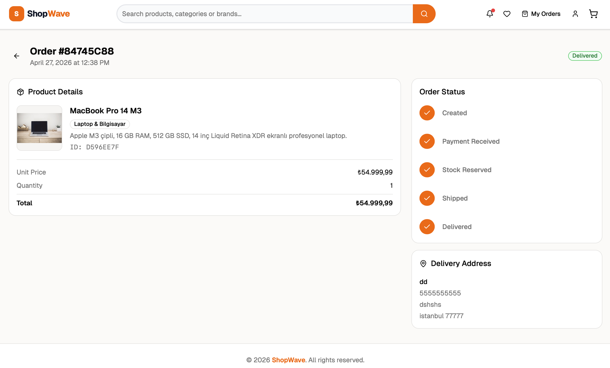
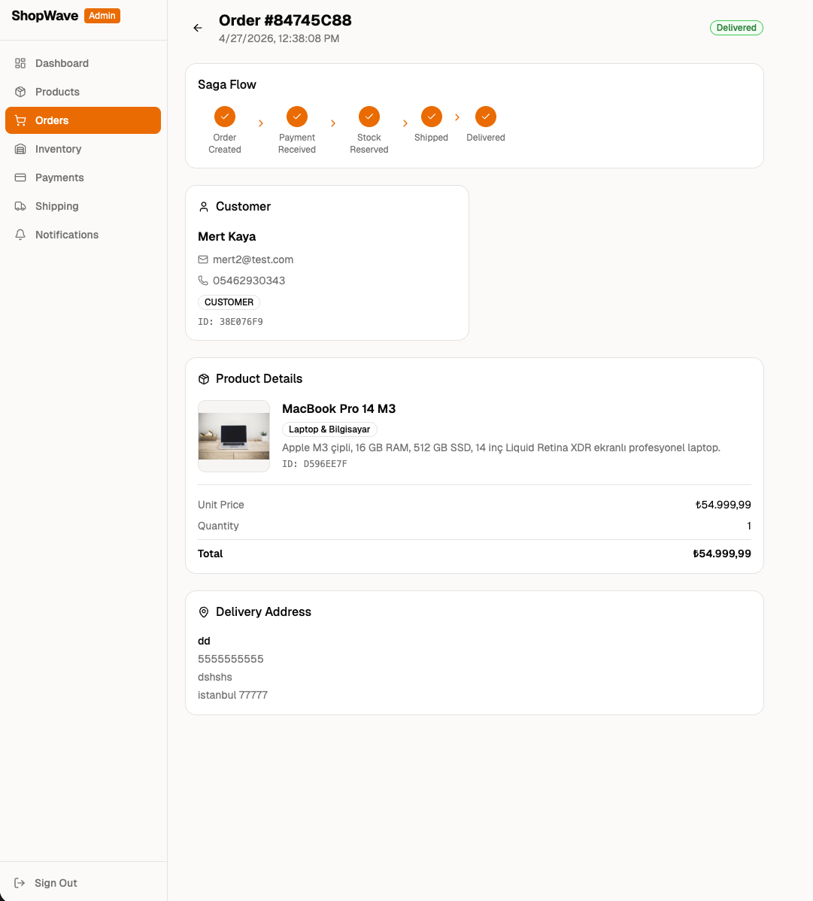

# ShopWave — Cloud-Native E-Commerce Platform

A cloud-native e-commerce backend system developed with a microservices architecture.

## Architectural Overview

8 independent Spring Boot microservices communicate asynchronously and in an event-driven manner via Apache Kafka. The Saga Orchestration pattern is implemented for order management; the Transactional Outbox Pattern and Idempotent Consumer approach are adopted to ensure data consistency.

```
                        ┌─────────────────┐
                        │   API Gateway   │  :8080
                        │  (JWT + Route)  │
                        └────────┬────────┘
                                 │
          ┌──────────┬───────────┼───────────┬──────────┐
          │          │           │           │          │
     Auth Svc   Product Svc  Order Svc  Payment Svc  ...
      :8081       :8082        :8084       :8085
          │          │           │           │
          └──────────┴─────── Kafka ─────────┴──────────┘
                                 │
                            PostgreSQL (database per service)
```

## Services

| Service | Port | Responsibility |
|--------|------|------------|
| api-gateway | 8080 | Routing, JWT validation, CORS |
| auth-service | 8081 | Registration, login, JWT / Refresh token |
| product-service | 8082 | Product CRUD, Redis cache |
| inventory-service | 8083 | Stock reservation and rollback |
| order-service | 8084 | Saga Orchestration — order flow |
| payment-service | 8085 | Payment processing, refund records |
| shipping-service | 8086 | Shipment tracking |
| notification-service | 8087 | Notification generation and storage |

## Technology Stack

**Backend**
- Java 21 + Spring Boot 3.x
- Spring Cloud Gateway
- Apache Kafka (asynchronous messaging)
- PostgreSQL (database-per-service)
- Redis (product list cache)
- Resilience4j (Circuit Breaker, Retry)
- JWT (Bearer Token authentication)
- Swagger / OpenAPI (in every service)

**Frontend**
- React 18 + TypeScript
- Tailwind CSS + shadcn/ui
- Zustand (client state)
- React Query (server state)

**DevOps / Cloud**
- Docker + Docker Compose
- Kubernetes (Minikube)
- GitHub Actions (CI/CD)
- Prometheus + Grafana (metrics monitoring)
- Zipkin (distributed request tracing)

## Core Architectural Patterns

### Saga Orchestration
Order Service orchestrates the entire order flow:
```
Order → Payment → Stock Reservation → Shipping → Notification
```
In case of failure, a compensating transaction is automatically triggered (payment refund, order cancellation).

### Transactional Outbox Pattern
Instead of publishing directly to Kafka, events are written to an outbox table within the same DB transaction as the business logic. A scheduler forwards them to Kafka every second.

### Idempotent Consumer
All Kafka consumers prevent duplicate messages via the `processed_events` table.

### Circuit Breaker
HTTP calls between services are protected with Resilience4j. The circuit opens when the error rate exceeds 50%.

## Kafka Topics

| Topic | Publisher | Consumer |
|-------|-----------|----------|
| order.created | Order | Payment |
| payment.success | Payment | Order, Inventory |
| payment.failed | Payment | Order |
| reserve.stock | Order | Inventory |
| stock.reserved | Inventory | Order, Shipping |
| stock.reserve.failed | Inventory | Order |
| refund.payment | Order | Payment |
| start.shipment | Order | Shipping |
| shipment.started | Shipping | Order, Notification |
| order.cancelled | Order | Inventory, Notification |
| notification.send | All services | Notification |

## Installation and Setup

### Requirements
- Docker Desktop (min 6GB RAM)
- Java 21
- Node.js 18+

### 1. Environment Variables

```bash
cp frontend/.env.example frontend/.env.local
```

Create your own values from the sample secret files in the `k8s/secrets/` folder.

### 2. Running with Docker Compose

```bash
# Start all backend services
docker-compose up --build -d

# Monitoring stack (optional)
docker-compose -f docker-compose.monitoring.yml up -d

# Frontend
cd frontend && npm install && npm run dev
```

Access:
- Frontend: `http://localhost:5173`
- API Gateway: `http://localhost:8080`
- Zipkin: `http://localhost:9411`
- Grafana: `http://localhost:3000` (admin/admin)
- Prometheus: `http://localhost:9090`

### 3. Running with Kubernetes (Demo)

```bash
# Automated setup script
chmod +x demo-k8s.sh && ./demo-k8s.sh
```

The script performs the following:
1. Starts Minikube
2. Loads Docker images
3. Applies Namespaces, ConfigMaps, Secrets, and Deployments
4. Creates databases
5. Opens port-forward tunnels

Access:
- API Gateway: `http://localhost:8080`
- Zipkin: `http://localhost:9411`

### 4. Swagger UI

Each service provides its own Swagger UI:

```
http://localhost:8081/swagger-ui.html  → Auth Service
http://localhost:8082/swagger-ui.html  → Product Service
http://localhost:8084/swagger-ui.html  → Order Service
...
```

### 5. Product Seed

```bash
chmod +x seed-products.sh && ./seed-products.sh
```

## Project Structure

```
shopwave/
├── api-gateway/
├── auth-service/
├── product-service/
├── order-service/           ← Saga Orchestrator (most critical)
├── inventory-service/
├── payment-service/
├── shipping-service/
├── notification-service/
├── frontend/                ← React + TypeScript
├── k8s/
│   ├── configmaps/
│   ├── deployments/
│   ├── services/
│   └── secrets/             ← Not added to Git
├── docker-compose.yml
├── docker-compose.monitoring.yml
├── prometheus.yml
└── demo-k8s.sh
```

Inner layer structure of each Spring Boot service:
```
src/main/java/.../
├── api/controller/          ← HTTP layer
├── api/request/             ← Incoming DTO (@Valid)
├── api/response/            ← Outgoing DTO
├── application/service/     ← Interface
├── application/impl/        ← Business logic
├── domain/entity/           ← JPA Entity
├── domain/exception/        ← Custom exception + GlobalExceptionHandler
├── infrastructure/repository/
├── infrastructure/kafka/producer/
├── infrastructure/kafka/consumer/
└── infrastructure/outbox/   ← Outbox Pattern
```

## CI/CD

GitHub Actions pipeline (`.github/workflows/ci-cd.yml`):
- Builds all services on every push
- Runs Maven tests
- Builds Docker images

## Screenshots

<table width="100%">
  <tr>
    <td width="50%" align="center" valign="top">
      <h3>Home Page</h3>
      
      <br/><br/>
      <h3>Checkout Flow</h3>
      
    </td>
    <td width="50%" align="center" valign="top">
      <h3>Admin Dashboard</h3>
      
    </td>
  </tr>
</table>
